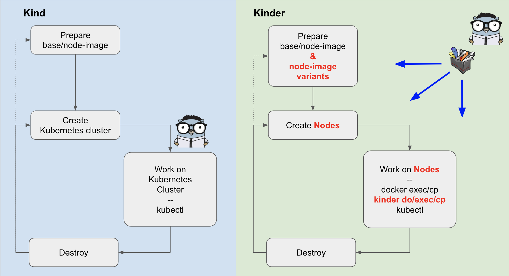

# Kinder

kinder is an example of [kind](https://github.com/kubernetes-sigs/kind) used as a library.

All the kind commands will be available in kinder, side by side with additional commands
designed for helping kubeadm contributors.

**kinder is a work in progress. Test it! Break it! Send feedback!**

See the kinder [roadmap](roadmap.md) for more information.

## Prerequisites

### Install git

Our source code is managed with [git](https://git-scm.com/), to develop locally you will need to install git.

You can check if git is already on your system and properly installed with the following command:

```bash
git --version
```

### Install Go

To work with kinder you will need [Go](https://golang.org/doc/install).

Install or upgrade [Go using the instructions for your operating system](https://golang.org/doc/install).
You can check if Go is in your system with the following command:

```bash
go version
```

Working with Go [modules](https://kind.sigs.k8s.io/docs/contributing/getting-started/which%20we%20use%20for%20dependency%20management) requires at least 1.11.4 due to checksum bugs
in lower versions.

## Getting started

Clone the kubeadm repository:

```bash
git clone https://github.com/kubernetes/kubeadm.git
```

And then build kinder

```bash
cd kinder
GO111MODULE=on go install
```

This will put kinder in $(go env GOPATH)/bin.

## Usage

kinder is based on kind, so it is recommended to read the [kind documentation](https://kind.sigs.k8s.io/docs/user/quick-start/) first.

What makes kinder different, is the fact that it is designed for helping kubeadm contributors,
so it provides a slightly different workflow that allows developers to take control of the cluster
bootstrap process.



### Prepare node-image & node-image variants

Kind can be extremely efficient when the node image contains all the necessary artifacts.

kinder allows kubeadm contributors to exploit this feature by implementing the `kinder build node-variant` command, that takes a node-image and allows to build variants by:

- Adding new pre-loaded images that will be made available on all nodes at cluster creation time
- Replacing the kubeadm binary installed in the image, e.g. with a locally build version of kubeadm
- Adding binaries for a second Kubernetes version to be used for upgrade testing

e.g. if you want to test a kubeadm version already built locally:

```bash
kinder build node-variant \
    --base-image kindest/node:v1.13.4 \
    --image kindest/node:PR1234 \
    --with-kubeadm $working_dir/kubernetes/bazel-bin/cmd/kubeadm/linux_amd64_pure_stripped/kubeadm
```

see [Prepare for tests](doc/prepare-for-tests.md) for more details.

### Create Nodes

By default kinder stops the cluster creation process before executing kubeadm init and kubeadm join;
this will give you nodes ready for installing Kubernetes and more specifically:

- The necessary prerequisites already installed on all nodes
- A kubeadm config file in `/kind/kubeadm.conf`
- In case of more than one control-plane node exists in the cluster, a pre-configured external load balancer

Additionally, the `kinder create` command gives you shortcuts for testing different Kubernetes cluster topologies without using the kind config file:

- Flag `--control-plane-nodes`
- Flag `--worker-nodes`

Similarly, `kinder create` command gives you also shortcuts for testing Kubernetes cluster variants:

- Flag `--kube-dns`
- Flag `--external-etcd`

### Work on Nodes

`kinder do` command is the kinder swiss knife.
It allows to execute actions (repetitive tasks/sequence of commands) on one or more nodes. Available actions are

| action          | Notes                                                        |
| --------------- | ------------------------------------------------------------ |
| kubeadm-init    | Executes the kubeadm-init workflow, installs the CNI plugin and then copies the kubeconfig file on the host machine.|
| manual-copy-certs      | Implement the manual copy of certificates to be shared across control-plane nodes (n.b. manual means not managed by kubeadm).|
| kubeadm-join    | Executes the kubeadm-join workflow both on secondary control plane nodes and on worker nodes.|
| kubeadm-upgrade |Executes the kubeadm upgrade workflow and upgrading K8s.|
| Kubeadm-reset   | Executes the kubeadm-reset workflow on all the nodes.|
| cluster-info    | Returns a summary of cluster info|
| smoke-test      | Implements a non-exhaustive set of tests|

kinder provides also `kinder exec` and `kinder cp` commands, a topology aware wrappers on `docker exec` and `docker cp`.

For more details please take a look at following how to guides:

- [Getting started (test single control-plane)](doc/getting-started.md)
- [Testing HA](doc/test-HA.md)
- [Testing upgrades](doc/test-upgrades.md)
- [Testing X on Y](doc/test-XonY.md)

or at the [Kinder reference](doc/reference.md)
